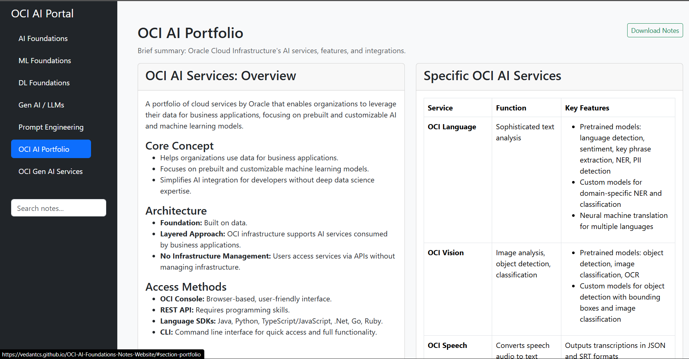

# 🚀 OCI AI Foundations Notes Portal

 <!-- replace with an actual screenshot path -->

> A fully responsive, interactive web portal that transforms my certification notes into a polished learning experience.

---

## 📚 Key Features
| Category | Highlights |
|----------|------------|
| **Organized Sections** | AI Foundations, ML, DL, Gen AI & LLMs, Prompt Engineering, OCI AI Portfolio, OCI Gen AI Services |
| **Interactive UI** | Accordion breakdowns, responsive cards, comparison tables |
| **Mobile-Ready** | Collapsible sidebar & fluid grid for phones, tablets, desktops |
| **Future Scope** | Search bar & bulk-note download designed and is visible but is not implemented |

---

## 🛠️ Tech Stack
| Layer | Tools |
|-------|-------|
| **Frontend** | HTML5 · CSS3 · (Basic)JavaScript |
| **Framework / UI** | Bootstrap 5 |

---

## 🚧Future Scope and Roadmap
- [ ] Integrate full-text search across notes  
- [ ] Enable bulk PDF download per section  
- [ ] Add dark-mode toggle  

---

## 🎯 Live Demo
Visit the site here → https://vedantcs.github.io/OCI-AI-Foundations-Notes-Website/

---

---

